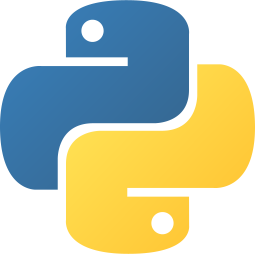
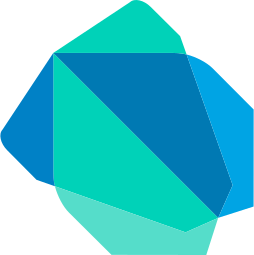
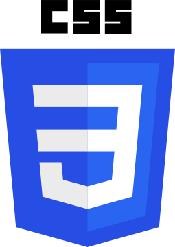
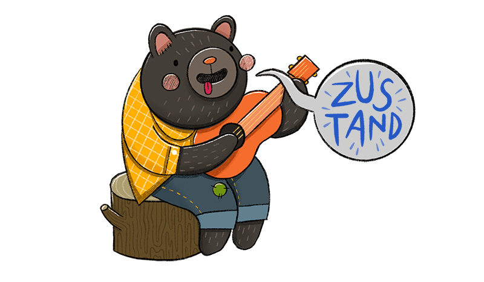
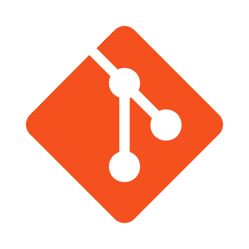
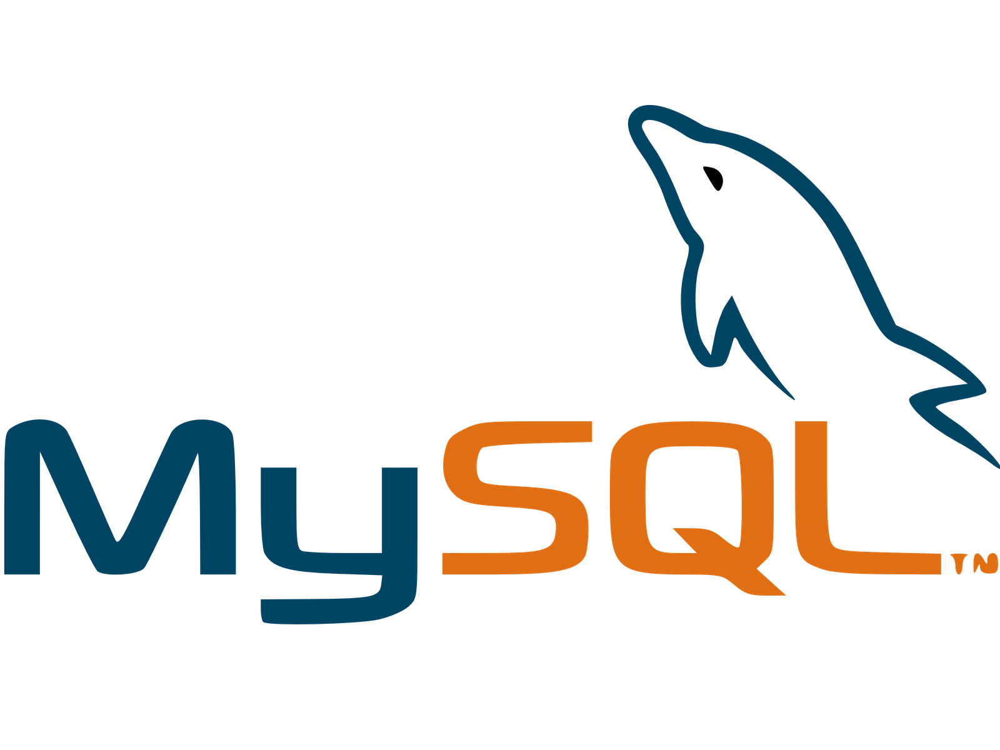
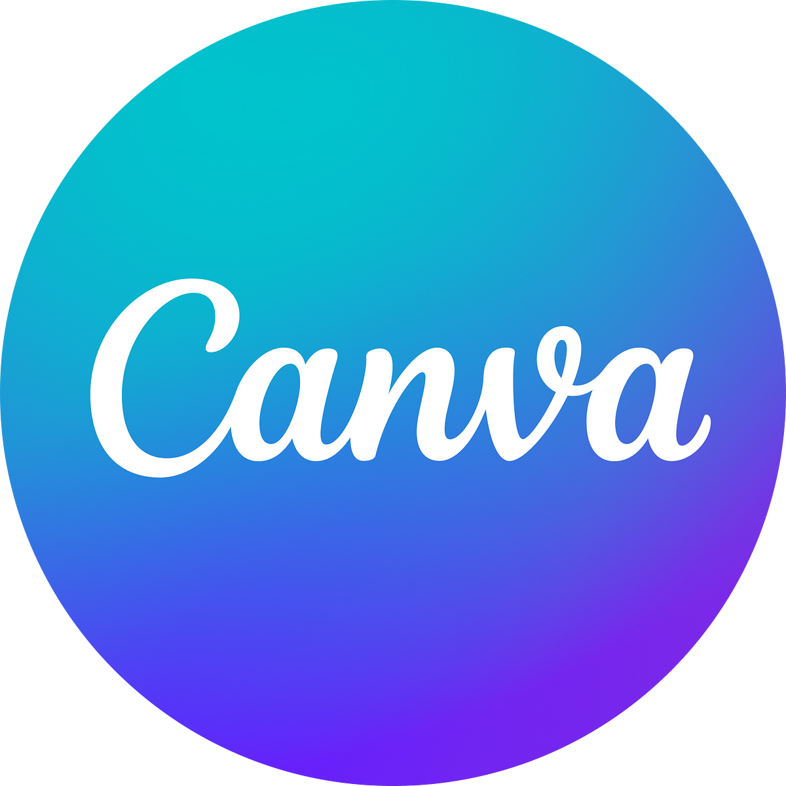
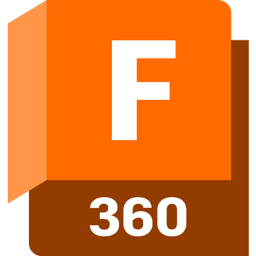
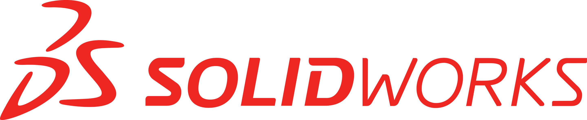
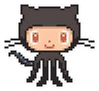

<!-- ====================== INTRO ====================== -->

<!--  -->
<!-- <h1 align="center">Hi, I'm Shantanu 👋🏼</h1>

<h3 align="center">Full Stack Web Developer, occasional Graphic Designer, Systems Programming Enthusiast and also an Engineering Student.</h3> -->

## Hey, I'm Shantanu 👋🏼

My name is Shantanu Wable (aka `shxntanu`) a 22 year old Full Stack Developer, occasional Graphic Designer, Low-level Programming Enthusiast and also a Software Engineer at Arista Networks.

> [Portfolio](https://shxntanu.vercel.app/)
> | [_shantanuwable2003@gmail.com_](mailto:shantanuwable2003@gmail.com)

<!-- - Full Stack Web Developer, Flutter Developer, Graphic Designer, Weeb, and a lot more.
- Likes to move pixels in Canva (Illustrator, Photoshop and Figma as well btw).
- Proficient in **Python, C++, Java & JavaScript/TypeScript**.
- Learning **C** as a hobby (and **Rust** to write the same code, but memory-safe).
- Knows Hindi, English, and Marathi.
- Likes clicking heads in Counter Strike & revving cars in Forza.
- How to reach me: **shantanuwable2003@gmail.com** -->

<!--  -->

<!-- ====================== ABOUT ME ====================== -->

## 🙋🏻‍♂️ About Me

I like to say that I am a full-stack developer, but I have had most experience from college in frontend development using **React**. I also have experience
in development with a wide variety of frameworks like **NextJS**, **Django**, **Angular**, **Spring**, **Flask**, and **Express** & Backend development in the Go runtime.

My domains of interest are primarily R&D in Distributed Systems, Programming Languages, Tackling challenges at Scale and Backend Development. I also like to dabble in Generative AI in my free time.

I'm a versatile programmer and can pick up and learn any language / framework in a short span of time. I have a keen interest in low-level programming
and like to read in-depth about computers and networking in my free time.

<!-- ## 🕵️‍♂️ Current

I've recently been intrigued by Generative AI and exploring the same while building my own little Python package [`lesa`](https://github.com/shxntanu/lesa). -->

<!-- ====================== PROJECTS ====================== -->

## ⚡️ Projects

<h3> Web</h3>

- [PageTalk](https://github.com/shxntanu/PageTalk): Ask Questions, gain summaries and take notes from any Document using the power of LLMs!
- [Solar Intelligence](https://github.com/shxntanu/solar-intelligence): Comprehensive Solar Data visualisation Platform ( **🏆 Winner at COEP MindSpark 2023** )
- [AIvelnirary](https://github.com/TechyMT/aivelnirary): AI-Powered Travel Itinerary creator that improves trip planning by generating personalized itineraries tailored to user preferences.
- [Pfi-Soc Club Website](https://pfisoc.com): Built the website for newly founded club, all in NextJS using TypeScript.
- [Gharam Masala](https://github.com/shxntanu/Gharam_Masala): Website for ordering home-cooked food. Made the front end as a part of Project Based Learning in First Year.
- [Portfolio Website](https://github.com/shxntanu/portfolio): Personal portfolio website.
- [usePopcorn](https://usepopcorn-but-better.netlify.app/): Movie List app in React.

<h3> Backend</h3>

- [Compliance Helper](https://github.com/shxntanu/compliance-helper): Parse and understand compliance standards documents extremely fast. Built for BMC Software as a part of a hackathon.
- [Minima-List](https://github.com/shxntanu/minima-list-ML): Get music recommendations based on the song that's currently occupying your mind.
- [PageTalk Backend - Express MongoDB](https://github.com/PageTalk/Backend-MongoDB): Backend made in Express.js, using Docker for containerisation, JWT and Bcrypt for Authentication, and MongoDB Atlas as a database, that interfaces with a LLaMa2 LLM, all in TypeScript.

<h3> Generative AI</h3>

- [Email Classifier](https://github.com/shxntanu/email-classifier): Email Classification and Rapid Automatic Re-routing with the power of LLMs and Distributed Task Queues. ( **🏆 Winner at Barclays Hack-O-Hire 2024** )
- [Lesa](https://github.com/shxntanu/lesa) : Building my own Python package which turns your terminal into a file interpreter.

<h3> Flutter</h3>

- [aerocode](https://github.com/shxntanu/aerocode): Code sharing web app without any sign-ups required. Made in Flutter!
- [frugalista](https://github.com/shxntanu/frugalista): A simple and minimalistic expense manager app
- [AutoInsight](https://github.com/shxntanu/AutoInsight): RaspberryPi-based Vehicle and Crash Detection system, powered by Flutter, as a part of Project-based learning.

<h3> C Language</h3>

- [hyperbloom](https://github.com/shxntanu/hyperbloom): High Concurrency Bloom Filter implementations in C.
- [tinySQL](https://github.com/shxntanu/tinysql): Writing SQLite from scratch in C.
- [HTTP Server](https://github.com/shxntanu/http-server-c): HTTP Server that accepts GET and POST Requests using Sockets and network protocols, made from scratch in C.
- [Arduino Scripts for locomotion using a PS4 controller](https://github.com/shxntanu/escalade-iitg-23)

<h3> Rust</h3>

- [Word Counter CLI in Rust](https://github.com/shxntanu/wc-rust)
- [JSON Parser in Rust](https://github.com/shxntanu/json-parser-rust)

<h3> Game Dev</h3>

- [AirHockey](https://github.com/shxntanu/air-hockey-pygame): Air Hockey game made purely in Python.

<!-- 

- <a href="https://medium.com/@shxntanu/from-urls-to-pixels-how-browsers-bring-the-internet-to-life-aabf3aaf92f9">From URLs to Pixels — How Browsers bring the Internet to life</a>

&nbsp;
 -->

## 🏃🏻 Open-source Contributions

- [@brillout/awesome-react-components](https://github.com/brillout/awesome-react-components)
- [@tldr-pages/tldr](https://github.com/tldr-pages/tldr)
- [@typescript-cheatsheets/react](https://github.com/typescript-cheatsheets/react)

## 🔧 Languages, Frameworks and Tools

<!-- 
 -->

**Languages**

>)

**Frameworks and Libraries**

**Databases and Tools**

**Design and Video Editing**

<!-- 
 -->

  <!-- 
   -->
  <!-- 
   -->
  <!-- 
   -->
  <!--  -->

<!-- Miscellaneous -->

<!-- 
 -->

<!-- 

 

   -->

  <!--  
   
 -->

## 📮 Let's Connect

[@shxntanu](https://linkedin.com/in/shxntanu) on all platforms.

<!-- 

 ### Profile Visitors

  

&nbsp;
 -->

<!-- 

 

 -->
